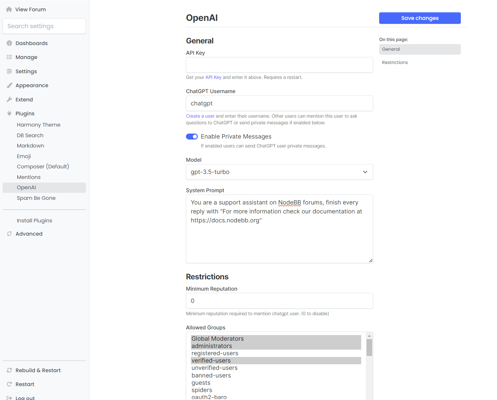

# OpenAI Plugin for NodeBB

This plugin let's users ask questions to ChatGPT in their forum posts by mentioning the chatgpt user with @<chat_gpt_username>. The user is created by admins and their username is set in the ACP page.

You can also allow users to send private messages to the chatgpt user.

If the chat gpt user is added to a public room it can answer questions by mentioning like in topics.

The model used can be changed in the ACP page.

Get an API key from openai at https://platform.openai.com/api-keys and save it in the ACP page of the plugin and restart your forum.

## Dependencies

This plugin requires nodebb-plugin-mentions to be installed and active.

## Installation

    npm install nodebb-plugin-openai

## Screenshots

